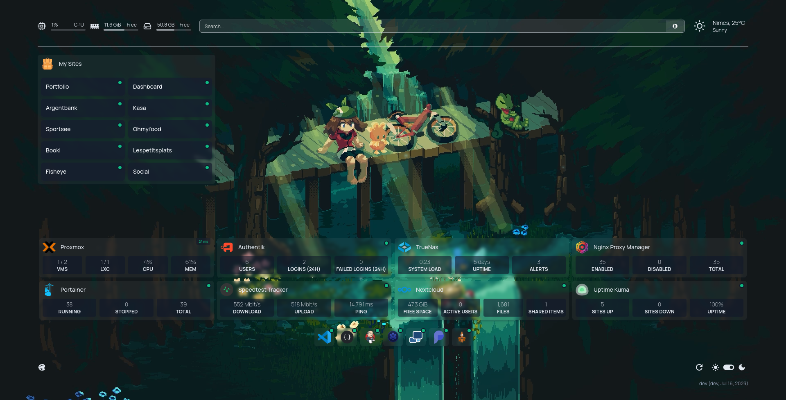

<p align="center">
  <picture>
    <source media="(prefers-color-scheme: dark)" srcset="images/banner_light@2x.png">
    
  </picture>
</p>

<p align="center">
  A modern <em>(fully static, fast)</em>, secure <em>(fully proxied)</em>, highly customizable application dashboard with integrations for more than 25 services and translations for over 15 languages. Easily configured via YAML files (or discovery via docker labels).
</p>

<p align="center">
  
</p>

<p align="center">
  
  
  
  
  
</p>

## Introduction

This project presents an enhanced version of the [homepage](https://github.com/benphelps/homepage), incorporating new visual functionalities to provide a refreshing and engaging user experience.  
Due to the rigorous entry criteria for pull requests in the original repository, I was unable to meet the requirements. As a result, I decided to create this project as an alternative solution to assist anyone who is looking to incorporate the new functionalities.

## New functionalities

- **Sub columns layout**:  
  This feature allows users to create sub-columns within a column, enabling more flexibility and organization in structuring content on the website.

- **New layout for row styles && positionement options**:  
  Users can now choose from a variety of new row styles and positioning options to customize the overall appearance and arrangement of their website's content.

- **Backpacks to regroup services and associated status**:  
  The backpack feature provides a convenient way for users to group services together and manage their associated status, making it easier to organize and track different elements of the website.

- **8 Columns limit**:  
  Users can now divide their content into up to eight columns, allowing for more extensive and intricate layouts on the website.

- **Services && Widgets auto wrap**:  
  With this functionality, services and widgets automatically wrap to the next line when they exceed the available space, ensuring a seamless and visually pleasing display regardless of screen size or resolution.

- **Grid combine**:  
  This feature enables users to combine grids, optimizing the website's responsiveness by creating dynamic layouts that adapt to different devices and screen sizes.

- **Video background**:  
  Users can now set a video as the background of their homepage, adding a captivating visual element that enhances the overall look and feel of the website.

- **Dot style status**:  
  With this added functionality, you have the option to choose between two styles for status indicators: "dot", "dot-outline." and the classic "text".

- **Possibility to set backpacks width**:  
  You can now set the width of the main content section and the backpacks section using a ratio syntax, such as "1/4". This ratio-based approach allows for more precise and proportional adjustments to the width of each section.

- **Possibility to hide group name**:  
  You have the option to hide the group name by specifying a number as the column name.

### Configuration

#### Sub columns layout

In the `services.yaml` you can create sub-columns.

```yml
---
- My Group Name:
    - 3:
        - Plausible: { Other Usual properties }
```

The number represent the number of subcolumns.

#### New layout for row styles && positionement options

In the `settings.yaml` file, you have various style options to customize the layout. Here are the available options:

```yaml
---
layout:
  1:
  2:
  3:
  4:
  5:
  6:
    style: auto-row-center-full
```

You can choose from the following styles:

- `auto-row`: This style displays only the services icon, without any specific alignment.
- `auto-row-center`: Services icons are centered within their respective sections.
- `auto-row-full`: The group is displayed, taking up the full width of the row.
- `auto-row-center-full`: This style centers the services icons and makes the group take up the full width of the row.
- `grid-center`: Services icons are centered within a grid layout.
- `grid`: This is the default layout.

By selecting the appropriate style option, you can control how the services and groups are displayed, achieving the desired visual presentation on your website.

#### Backpacks to regroup services and associated status

In the `backpacks.yaml` file, the backpacks and their associated services are defined as follows:

```yaml
---
- My Sites:
    - Portfolio:
        href: https://example.com
        server: my-docker
        container: portfolio
    - Dashboard:
        href: https://dashboard.example.com
        server: my-docker
        container: dashboard
    - Argentbank:
        href: https://argentbank.example.com
        server: my-docker
        container: argentbank
```

The backpacks will be displayed using the `auto-row` style, which means they will automatically adjust to fit the available space. Additionally, all child services within each backpack will be combined into a single entity, allowing for a compact and streamlined representation of the services. This ensures a clean and organized display of your backpacks and their respective services.

#### Grid combine

In the `settings.yaml` file, you can find the configuration options for the backpacks:

```yaml
---
backpacks:
  My Sites:
    columns: 2
    widthRatio: 2/4
    style: grid-preserve
  Test:
    columns: 1
    widthRatio: 2/4
```

When it comes to the `style` property, there are two options available:

1. `grid-combine` (default): This style combines the services within the backpack, optimizing space usage and minimizing any potential gaps between services. It provides a compact and streamlined display.

2. `grid-preserve`: This style maintains a classic grid layout for the services in the backpack. While it retains the traditional grid structure, it may introduce some unwanted spaces, depending on the arrangement and dimensions of the services.

#### Dot style status

In the `settings.yaml` file, you will find the following options for the `status` property:

```yaml
---
status:
  type: "dot-outline"
```

You can choose from three available options for the `type` property:

1. "dot-outline": This option represents the status using a dot icon with an outline. It provides a clear and visually distinct indicator for the status.

2. "dot": This option represents the status using a solid dot icon. It offers a simple and visually concise indicator for the status.

3. "text" (default): This option represents the status using text. It allows you to display the status using customized text labels, providing flexibility in conveying the status information.

#### Possibility to set backpacks width

In the `settings.yaml` file, you can utilize the `widthRatio` property to define the desired width for the backpacks. Let's take a look at the provided example:

```yaml
---
backpacks:
  My Sites:
    icon: mdi-bag-personal-outline
    columns: 2
    widthRatio: 1/4
    style: grid-preserve
  Test:
    icon: mdi-bag-personal-outline
    columns: 1
    widthRatio: 1/4
```

Using the `widthRatio` property, you can specify the expected width for each backpack relative to the available space. In this case, a ratio of `1/4` is set for both the "My Sites" and "Test" backpacks. This means that each backpack will occupy one-fourth (25%) of the available width.

#### Possibility to hide groups names

In the `services.yaml` or `backpacks.yml` file, you can utilize the following syntax to hide the group name:

```yaml
---
- 1:
    - Proxmox:
        icon: proxmox
        href: https://proxmox.iloa.dev
        ping: https://proxmox.iloa.dev

    - Portainer:
        href: https://portainer.iloa.dev/
        icon: portainer.png
        server: my-docker
        container: portainer
```

By setting the group name to a number, such as `1`, the group name will be hidden. However, please note that group names must be unique across all groups. Each group should have a distinct and different name to ensure proper organization and differentiation between the groups on your website.

## Features

- **Fast!** The entire site is statically generated at build time, so you can expect instant load times
- **Secure!** Every API request to backend services goes through a proxy server, so your API keys are never exposed to the frontend client.
- Images built for AMD64 (x86_64), ARM64, ARMv7 and ARMv6
  - Supports all Raspberry Pi's, most SBCs & Apple Silicon
- Full i18n support with translations for Catalan, Chinese, Dutch, Finnish, French, German, Hebrew, Hungarian, Malay, Norwegian Bokmål, Polish, Portuguese, Portuguese (Brazil), Romanian, Russian, Spanish, Swedish and Yue
  - Want to help translate? [Join the Weblate project](https://hosted.weblate.org/engage/bulby/)
- Service & Web Bookmarks
- Docker Integration
  - Container status (Running / Stopped) & statistics (CPU, Memory, Network)
  - Automatic service discovery (via labels)
- Service Integration
  - Sonarr, Radarr, Readarr, Prowlarr, Bazarr, Lidarr, Emby, Jellyfin, Tautulli, Plex and more
  - Ombi, Overseerr, Jellyseerr, Jackett, NZBGet, SABnzbd, ruTorrent, Transmission, qBittorrent and more
  - Portainer, Traefik, Speedtest Tracker, PiHole, AdGuard Home, Nginx Proxy Manager, Gotify, Syncthing Relay Server, Authentik, Proxmox and more
- Information Providers
  - Coin Market Cap, Mastodon and more
- Information & Utility Widgets
  - System Stats (Disk, CPU, Memory)
  - Weather via [OpenWeatherMap](https://openweathermap.org/) or [Open-Meteo](https://open-meteo.com/)
  - Web Search Bar
  - UniFi Console, Glances and more
- Instant "Quick-launch" search
- Customizable
  - 21 theme colors with light and dark mode support
  - Background image support
  - Column and Row layout options

## Support & Suggestions

If you have any questions, suggestions, or general issues, please start a discussion on the [Discussions](https://github.com/lukylix/bulby/discussions) page.

For bug reports, please open an issue on the [Issues](https://github.com/lukylix/bulby/issues) page.

## Getting Started

For configuration options, examples and more, [please check out the original site](https://gethomepage.dev).

### With Docker

Image on docker hub comming soon.

Here are the complete commands you will need to execute:

```bash
git clone https://github.com/Lukylix/Bulby.git
cd Bulby
docker build -t bulby .
```

Using docker compose:

```yaml
version: "3.3"
services:
  bulby:
    image: bulby:latest
    container_name: bulby
    ports:
      - 3000:3000
    volumes:
      - /path/to/config:/app/config # Make sure your local config directory exists
      - /var/run/docker.sock:/var/run/docker.sock:ro # (optional) For docker integrations
```

or docker run:

```bash
docker run -p 3000:3000 -v /path/to/config:/app/config -v /var/run/docker.sock:/var/run/docker.sock bulby:latest
```

### With Node

First, clone the repository:

```bash
git clone https://github.com/lukylix/bulby.git
```

Then install dependencies and build the production bundle (I'm using pnpm here, you can use npm or yarn if you like):

```bash
pnpm install
pnpm build
```

If this is your first time starting, copy the `src/skeleton` directory to `config/` to populate initial example config files.

Finally, run the server:

```bash
pnpm start
```

## Configuration

Configuration files will be generated and placed on the first request.

Configuration is done in the /config directory using .yaml files. Refer to each config for
the specific configuration options.

You may also check [the homepage site](https://gethomepage.dev) for detailed configuration instructions, examples and more.

## Development

Install NPM packages, this project uses [pnpm](https://pnpm.io/) (and so should you!):

```bash
pnpm install
```

Start the development server:

```bash
pnpm dev
```

Open [http://localhost:3000](http://localhost:3000) to start.

This is a [Next.js](https://nextjs.org/) application, see their doucmentation for more information:

## Contributors

<!-- ALL-CONTRIBUTORS-LIST:START - Do not remove or modify this section -->
<!-- prettier-ignore-start -->
<!-- markdownlint-disable -->

<!-- markdownlint-restore -->
<!-- prettier-ignore-end -->

<!-- ALL-CONTRIBUTORS-LIST:END -->

<!-- ALL-CONTRIBUTORS-BADGE:START - Do not remove or modify this section -->

[](#contributors)

<!-- ALL-CONTRIBUTORS-BADGE:END -->
